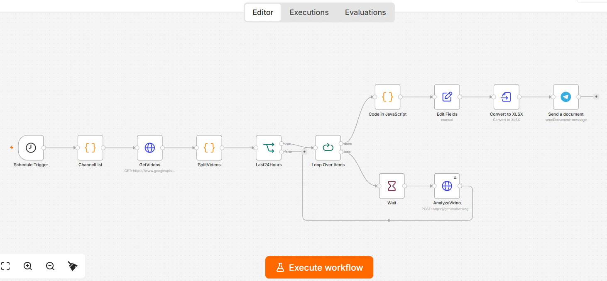
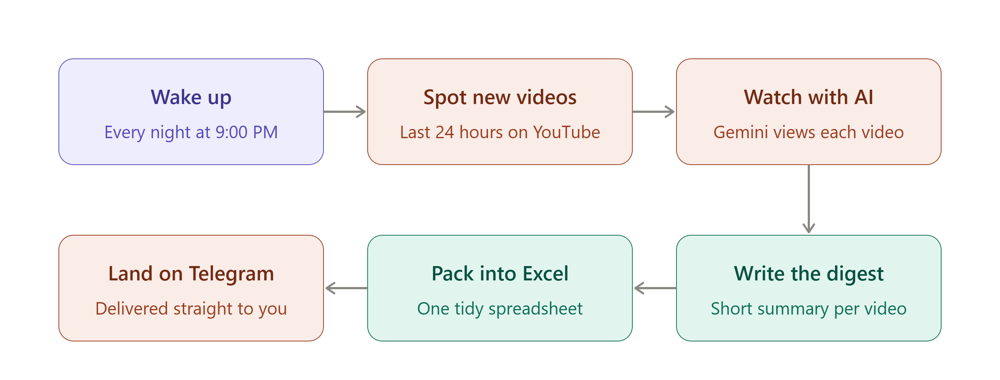

# YouTube Channel Monitoring & AI Video Digest Automation

An **n8n workflow** that automatically monitors selected YouTube channels and creates a daily AI-powered digest of newly published videos.

## What It Does

The workflow runs automatically every day and:

1. Fetches the latest videos from a YouTube channel.
2. Filters videos published within the last 24 hours.
3. Processes each video individually.
4. Uses **Google Gemini AI** to generate a short summary of the video.
5. Creates an Excel (`.xlsx`) report containing:

   * Channel name
   * Video title
   * Published date
   * Video URL
   * AI-generated summary
6. Sends the Excel digest to **Telegram**.

## Workflow

## Technologies Used

* **n8n** – Workflow automation
* **YouTube Data API** – Retrieve channel videos
* **Google Gemini API** – AI video analysis and summarization
* **Telegram Bot API** – Deliver the daily report
* **XLSX** – Generate the final report

## Setup

Import the workflow JSON into n8n and configure your own:

* YouTube API key
* Gemini API key
* YouTube channel ID
* Telegram credentials
* Telegram chat ID

> **Note:** API keys and personal credentials are not included in this repository.

## Example Output

The generated Excel report contains:

| Channel         | Video Title   | Published At | Video URL   | AI Summary           |
| --------------- | ------------- | ------------ | ----------- | -------------------- |
| Example Channel | Example Video | 2026-10-04   | YouTube URL | AI-generated summary |

